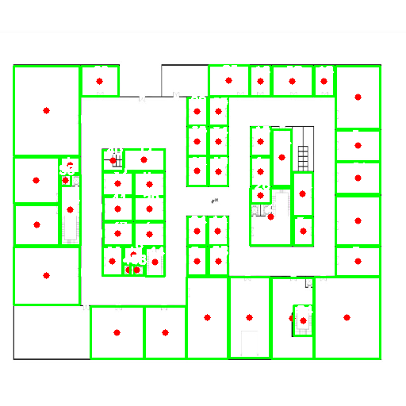
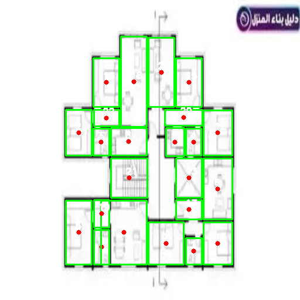

# Architectural Floorplan Parser: Hybrid YOLO & Transformer Framework

This repository features the core computer vision pipeline of an end-to-end graduation project designed to parse, segment, and vectorize unstructured physical floor plans into hierarchical, structured geometric data and topological JSON coordinates.

The system demonstrates high-fidelity performance (**~88% generalization accuracy**) in parsing structural elements, isolating distinct multi-class structural blocks, and extracting pixel topologies despite dense standard dimensions, architectural annotations, and multilingual text interference.

## 🧠 System Architecture Overview
The pipeline utilizes a **Hybrid Dual-Model Approach** to combine localized object detection with global contextual semantics:

1. **Spatial Localization (YOLO):** A customized YOLO framework identifies and extracts tight bounding boxes for distinct architectural layout units while enforcing strict **Non-Maximum Suppression (NMS)** to eradicate redundant overlaps.
2. **Contextual Segmentation & Feature Extraction (ResNet50 + Transformer):** A ResNet50 CNN backbone extracts dense spatial layers, which are reshaped and fused with learnable positional embeddings. A 4-layer deep **Transformer Encoder Block** processes these sequences to model global context boundaries, which are then passed into a Transpose CNN decoder to map raw structures into dynamic segmentation masks.

By merging YOLO's explicit geometry with the Transformer's dense feature vectors (`transformer_features`), the script yields clean coordinate contours and centralized JSON structural tokens.

## 📊 Performance & Visual Results
The model excels at capturing recurrent parallel layouts, dynamic service zones, and open structural configurations. It actively filters structural noise and retains sharp, straight geometric boundaries.

### Inference Samples:
Below are samples of the output generated by the hybrid pipeline, illustrating detected structural centers (red keypoints) and bounding contours (green polygons):

| Structural Layout Segmentation | Institutional Space Parsing |
|---|---|
|  |  |
| **Robust Functional Boundaries:** Effectively isolates distinct structural blocks and dynamic layout units, even when cross-referenced with dense bilingual text and architectural dimension marks. | **High Mass-Scale Recall:** Demonstrates strong capacity in tracking and encapsulating high-density, sequential interior zones across expansive architectural footprints. |

## 🛠️ Pipeline Features
- **Adaptive Functional Tracking:** Evaluates spatial metrics using dynamic threshold metrics rather than static, rigid thresholding to avoid missing wide, open architectural spaces.
- **Hierarchical Topologies:** Outputs structured data dictionary vectors directly mapping extracted element IDs, center mass keys, corner coordinates, and latent transformer arrays.
- **Automated Visualization:** Automatically renders labeled contour overlays and dynamic polygon wrappers over complex multi-scale layouts.

## 💻 Dependencies
- Python 3.8+
- TensorFlow 2.x
- Ultralytics (YOLO)
- OpenCV
- NumPy

## 📂 Quick Start

1. **Download the Trained Weights:**
   Since model weight files are too large for GitHub storage limits, download the pre-trained weights from your cloud storage links:
   - [Download YOLO Weights (`best.pt`)]
   - [Download Segmentation Weights (`floorplan_segmentation_final.keras`)]

2. **Setup Environment:**
   Place both downloaded weight files directly into the root directory of this repository.

3. **Run the Pipeline:**
   Execute the hybrid parsing script:
   ```bash
   python main.py
